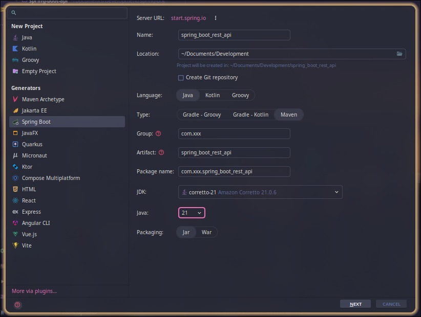
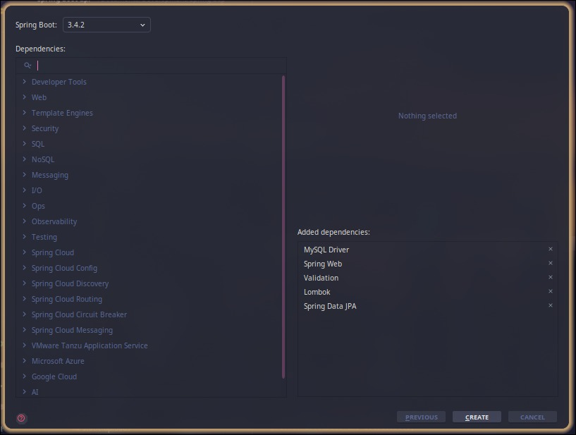
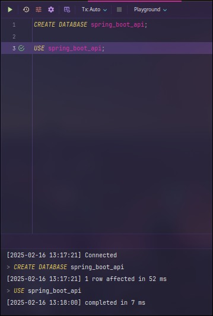
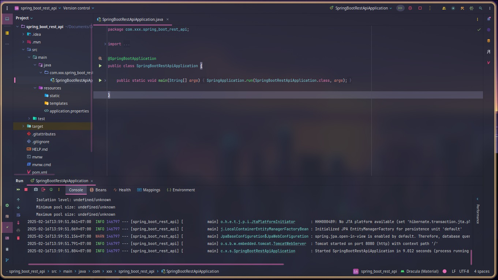

Dalam artikel ini kita akan belajar membuat Restful API menggunakan Spring Boot, yang mana seri artikel ini akan dibagi step by step dari dasar hingga testing di Postman. Dan kita juga akan belajar structural folder yang mudah di maintenance nantinya.

## ✨ Langkah 1 - Instalisasi Kebutuhan

- **Instalasi Java**：https://www.oracle.com/java/technologies/javase/jdk17-archive-downloads.html
- **Instalasi Maven**：https://maven.apache.org/download.cgi
- **Instalasi Intelij Idea**：https://www.jetbrains.com/idea/download
- **Instalasi Datagrip**：https://www.jetbrains.com/datagrip/download/

Note : Mungkin Anda bertanya-tanya mengapa harus pakai Intelij Idea ataupun Datagrip? Pertanyaan yang menarik, seharusnya tidak harus pakai itu akan tetapi pada case kali ini saya akan menggunakan beberapa tools diatas. Jika saat ini Anda hanya memakai PHPMyAdmin so tidak masalah, mari kita lanjut!

## 👨🏻‍💻 Langkah 2 - Membuat Project Spring Boot

Pertama kali, saya akan menunjukkan Anda bagaimana menggunakan Intelij Idea. Buka **Intelij Idea** Anda dan silakan buat **New Project**.

- **Step 1 - Lakukan pengisian beberapa field dan sesuaikan java yang Anda install**


- **Step 2 - Lakukan instalisasi dependency yang dibutuhkan dan klik Create dan tunggu beberapa saat**


## ✨ Langkah 3 - Membuat Database melalui Datagrip

Setelah itu, Anda dapat membuat database pada Datagrip atau tools semacamnya.


## 👨🏻‍💻 Langkah 4 - Setup Application.properties

Selanjutnya, Anda bisa masuk ke file application.properties, yang terletak pada **src/main/java/com.xxx.spring_boot_rest_api/resources/application.properties** dengan mengisi kode seperti berikut ini.

```bash
# Database Configuration
spring.datasource.url=jdbc:mysql://localhost:3306/spring_boot_api
spring.datasource.username=root
spring.datasource.password=new-password
spring.jpa.hibernate.ddl-auto=update
spring.datasource.driver-class-name=com.mysql.cj.jdbc.Driver

# Port Configuration
server.port=8080
```

## ✨ Langkah 5 - Menjalankan Project Spring Boot

Jika memang semua tidak ada masalah, harusnya sekarang kita sudah bisa menjalakan project Spring Boot nya.


Mungkin itu saja yang dapat saya sampaikan pada sesi artikel ini, semoga tulisan ini dapat bermanfaat bagi temen-temen. Saya akan melihat Anda di artikel berikutnya!

<!-- ## 📜 许可证 -->
<!-- AstroRainbow 根据 MIT 许可证授权，版权所有 © 2024。你可以自由地使用、修改和分发这个主题，只要你遵守 LICENSE 文件中规定的条款。 -->