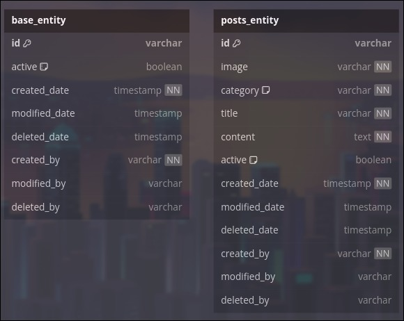

Pada seri artikel ini kita akan berfokus pada **entities** dan **repository**, yang mana akan dibagi step by step.

## ✨ Langkah 1 - Skema Database 

Mungkin Anda bertanya-tanya mengapa ada dua table? Secara sederhana nya adalah table BaseEntity me-extends PostEntity.


## 👨🏻‍💻 Langkah 2 - Menyiapkan Entities

- **Step 1 - Lakukan pembuatan BaseEntity**

Setelah itu, silahkan membuat file **BaseEntity.java** pada folder 📂 entities kemudian isikan kodenya menjadi seperti berikut ini.

```bash
import jakarta.persistence.*;
import jakarta.validation.constraints.NotNull;
import lombok.Data;
import org.hibernate.annotations.DynamicUpdate;

import java.time.LocalDateTime;
import java.util.UUID;

@MappedSuperclass
@DynamicUpdate
@Data
public class BaseEntity {
    @Id
    @Column(name = "id")
    private String id;

    @Column(name = "active", columnDefinition = "TINYINT default 1")
    @Convert(converter = org.hibernate.type.NumericBooleanConverter.class)
    @NotNull
    private Boolean active;

    @Column(name = "created_date")
    @NotNull
    private LocalDateTime createdDate;

    @Column(name = "modified_date")
    private LocalDateTime modifiedDate;

    @Column(name = "deleted_date")
    private LocalDateTime deletedDate;

    @Column(name = "created_by")
    @NotNull
    private String createdBy;

    @Column(name = "modified_by")
    private String modifiedBy;

    @Column(name = "deleted_by")
    private String deletedBy;

    @PrePersist
    public void prePersist() {
        this.id = UUID.randomUUID().toString();
        this.active = true;
        this.createdDate = LocalDateTime.now();
        this.createdBy = "SYSTEM";
    }

    @PreUpdate
    public void preUpdate() {
        this.modifiedDate = LocalDateTime.now();
    }

    @PreRemove
    public void preRemove() {
        this.deletedDate = LocalDateTime.now();
        this.active = false;
    }
}
```

- **Step 2 - Lakukan pembuatan PostEntity**

Selanjutnya, silahkan membuat file **PostEntity.java** pada folder 📂 entities kemudian isikan kodenya menjadi seperti berikut ini.

```bash
import com.xxx.spring_boot_rest_api.repositories.enumeration.CategoryTypeEnum;
import jakarta.persistence.*;
import lombok.AllArgsConstructor;
import lombok.Data;
import lombok.NoArgsConstructor;

@Entity
@Data
@NoArgsConstructor
@AllArgsConstructor
@Table(name = "posts")
public class PostEntity extends BaseEntity {
    @Column(nullable = false)
    private String image;

    @Enumerated(EnumType.STRING)
    @Column(nullable = false)
    private CategoryTypeEnum category;

    @Column(nullable = false)
    private String title;

    @Column(nullable = false)
    private String content;
}
```

Oia, mungkin Anda setelah mengisi kode dari PostEntity mengalami masalah CategoryTypeEnum Cannot Resolve, error tersebut karena kita belum bikin filenya. Mari kita buat filenya pada folder 📂 enumeration dengan nama **CategoryTypeEnum.java**, kemudian isikan kodenya menjadi seperti berikut ini

```bash
import java.util.List;

public enum CategoryTypeEnum {
    FOOD("MAKANAN"),
    DRINK("MINUMAN"),
    ELECTRONIC("ELEKTRONIK"),
    SPORT("OLAHRAGA"),
    AUTOMOTIVE("OTOMATIF"),
    CARPETTING("PERTUKANGAN");

    private String value;

    CategoryTypeEnum(String value) {
        this.value = value;
    }

    public String getValue() {
        return value;
    }

    public static List<CategoryTypeEnum> getAllEnum() {
        return List.of(FOOD, DRINK, ELECTRONIC, SPORT, AUTOMOTIVE, CARPETTING);
    }
}
```

## ✨ Langkah 3 - Menyiapkan Repository

Setelah menyiapkan semua diatas, mari kita menyiapkan **PostRepository.java** pada folder 📂 repositories, kemudian isikan kodenya menjadi seperti berikut ini.

```bash
import com.xxx.spring_boot_rest_api.repositories.entities.PostEntity;
import org.springframework.data.jpa.repository.JpaRepository;
import org.springframework.stereotype.Repository;

@Repository
public interface PostRepository extends JpaRepository<PostEntity, String> {
}
```

Mungkin itu saja yang dapat saya sampaikan pada sesi artikel ini, semoga tulisan ini dapat bermanfaat bagi temen-temen. Saya akan melihat Anda di artikel berikutnya!