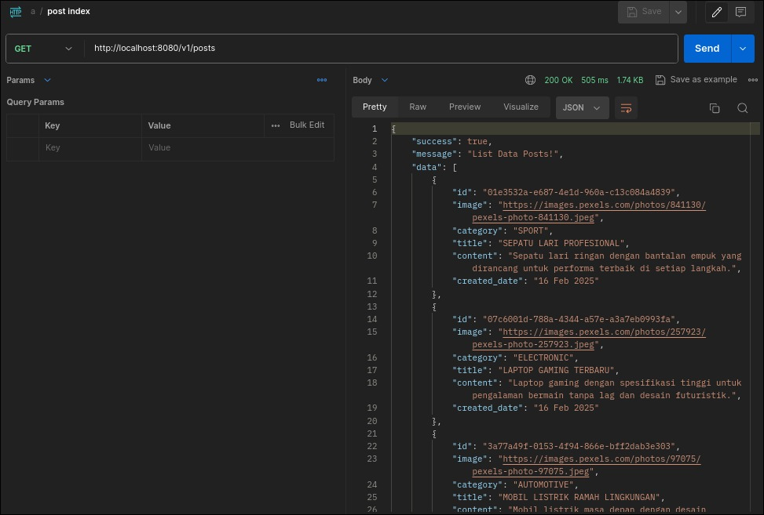

Pada seri artikel ini kita akan berfokus pada bagaimana menampilkan banyak data dari database, yang mana akan dibagi step by step.

## ✨ Langkah 1 - Menyiapkan Response

Pertama kali, silahkan membuat file **PostResponseV1.java** pada folder 📂 response, kemudian isikan kodenya menjadi seperti berikut ini.

```bash
import com.fasterxml.jackson.annotation.JsonIgnore;
import com.fasterxml.jackson.annotation.JsonInclude;
import com.fasterxml.jackson.annotation.JsonProperty;
import com.fasterxml.jackson.databind.PropertyNamingStrategies;
import com.fasterxml.jackson.databind.annotation.JsonNaming;
import com.xxx.spring_boot_rest_api.repositories.enumeration.CategoryTypeEnum;
import com.xxx.spring_boot_rest_api.utils.date.Date;
import lombok.AllArgsConstructor;
import lombok.Builder;
import lombok.Data;
import lombok.NoArgsConstructor;

import java.time.LocalDateTime;

@Data
@Builder
@NoArgsConstructor
@AllArgsConstructor
@JsonNaming(PropertyNamingStrategies.SnakeCaseStrategy.class)
@JsonInclude(JsonInclude.Include.NON_NULL)
public class PostResponseV1 {
    private String id;
    private String image;
    private CategoryTypeEnum category;
    private String title;
    private String content;

    @JsonIgnore
    private LocalDateTime createdDate;
    @JsonProperty
    private String getCreatedDate() {
        return Date.formatShortMonth(createdDate); 
    }

    @JsonIgnore
    private LocalDateTime modifiedDate;
    @JsonProperty
    private String getModifiedDate() {
        return Date.formatShortMonth(modifiedDate);
    }
}
```

## 👨🏻‍💻 Langkah 2 - Menyiapkan Service

- **Step 1 - Lakukan pembuatan PostServiceV1**

Setelah itu, silahkan membuat file **PostServiceV1.java** pada folder 📂 services -> 📂 v1, kemudian isikan kodenya menjadi seperti berikut ini.

```bash
import com.xxx.spring_boot_rest_api.response.v1.PostResponseV1;

import java.util.List;

public interface PostServiceV1 {
    List<PostResponseV1> index();
}
```

- **Step 2 - Lakukan pembuatan PostServiceImplV1**

Kemudian silahkan membuat file **PostServiceImplV1.java** pada folder 📂 services -> 📂 v1 -> 📂 impl, kemudian isikan kodenya menjadi seperti berikut ini.

```bash
import com.xxx.spring_boot_rest_api.repositories.PostRepository;

import com.xxx.spring_boot_rest_api.repositories.entities.PostEntity;
import com.xxx.spring_boot_rest_api.response.v1.PostResponseV1;
import com.xxx.spring_boot_rest_api.services.v1.PostServiceV1;
import lombok.RequiredArgsConstructor;
import org.springframework.stereotype.Service;

import java.util.ArrayList;
import java.util.List;

@Service
@RequiredArgsConstructor
public class PostServiceImplV1 implements PostServiceV1 {
    private final PostRepository postRepository;

    @Override
    public List<PostResponseV1> index() {
        List<PostEntity> posts = postRepository.findAll();
        List<PostResponseV1> responses = new ArrayList<>();
        for (PostEntity post : posts) {
            responses.add(responses(post));
        }
        return responses;
    }

    private PostResponseV1 responses(PostEntity entity) {
        return PostResponseV1.builder()
                .id(entity.getId())
                .image(entity.getImage())
                .category(entity.getCategory())
                .title(entity.getTitle())
                .content(entity.getContent())
                .createdDate(entity.getCreatedDate())
                .modifiedDate(entity.getModifiedDate())
                .build();
    }
}
```

## ✨ Langkah 3 - Menyiapkan Controller

- **Step 1 - Lakukan pembuatan PostControllerV1**

Setelah itu, silahkan membuat file **PostControllerV1.java** pada folder 📂 controller -> 📂 v1, kemudian isikan kodenya menjadi seperti berikut ini.

```bash
import com.xxx.spring_boot_rest_api.response.v1.PostResponseV1;
import com.xxx.spring_boot_rest_api.utils.response.ApiResponse;
import org.springframework.web.bind.annotation.*;

import java.util.List;

@RestController
@RequestMapping("v1/posts")
public interface PostControllerV1 {

    @GetMapping
    ApiResponse<List<PostResponseV1>> index();
    
}
```

- **Step 2 - Lakukan pembuatan PostControllerImplV1**

Kemudian silahkan membuat file **PostControllerImplV1.java** pada folder 📂 controller -> 📂 v1 -> 📂 impl, kemudian isikan kodenya menjadi seperti berikut ini.

```bash
import com.xxx.spring_boot_rest_api.controller.v1.PostControllerV1;
import com.xxx.spring_boot_rest_api.response.v1.PostResponseV1;
import com.xxx.spring_boot_rest_api.services.v1.PostServiceV1;
import com.xxx.spring_boot_rest_api.utils.response.ApiResponse;
import lombok.RequiredArgsConstructor;
import org.springframework.stereotype.Controller;
import org.springframework.web.bind.annotation.ResponseBody;

import java.util.List;

@Controller
@ResponseBody
@RequiredArgsConstructor
public class PostControllerImplV1 implements PostControllerV1 {

    private final PostServiceV1 postServiceV1;

    @Override
    public ApiResponse<List<PostResponseV1>> index() {
        List<PostResponseV1> responses = postServiceV1.index();
        if (responses != null) {
            return new ApiResponse<>(true, "List Data Posts!", responses);
        } else {
            return new ApiResponse<>(false, "List Data Post Gagal!", null);
        }
    }
}
```

## 👨🏻‍💻 Langkah 4 - Testing di Postman

Setelah semua setup diatas, harusnya sudah tidak masalah dan kita coba untuk melakukan-nya.




Mungkin itu saja yang dapat saya sampaikan pada sesi artikel ini, semoga tulisan ini dapat bermanfaat bagi temen-temen. Saya akan melihat Anda di artikel berikutnya!